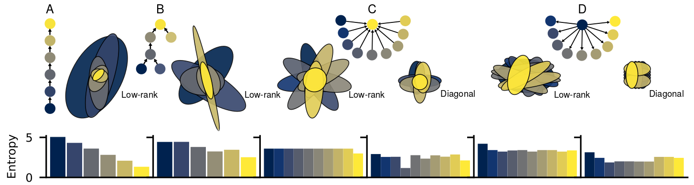
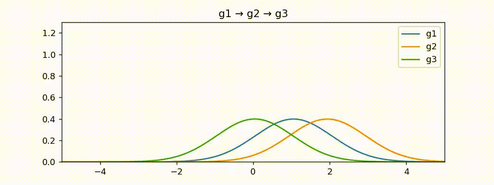
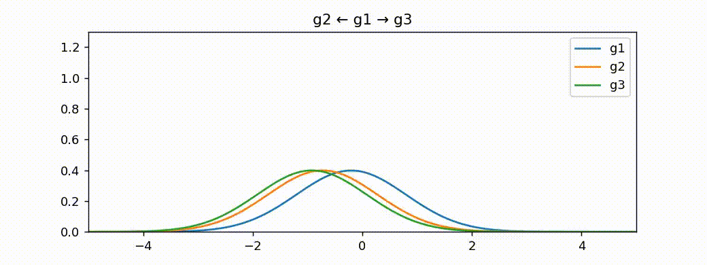
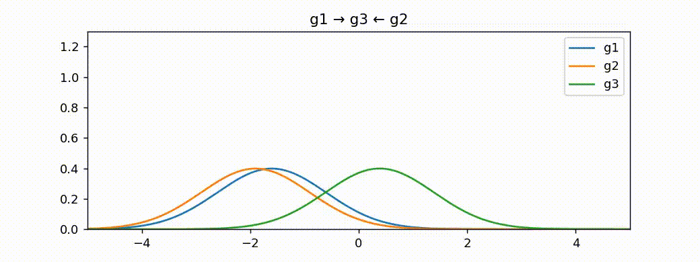
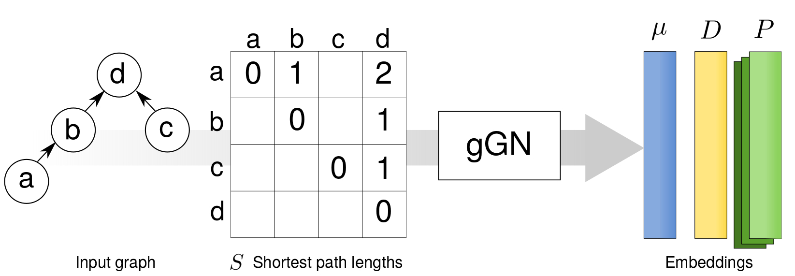
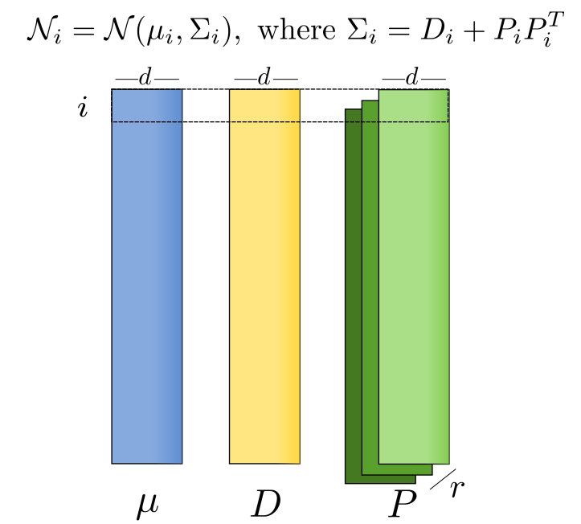
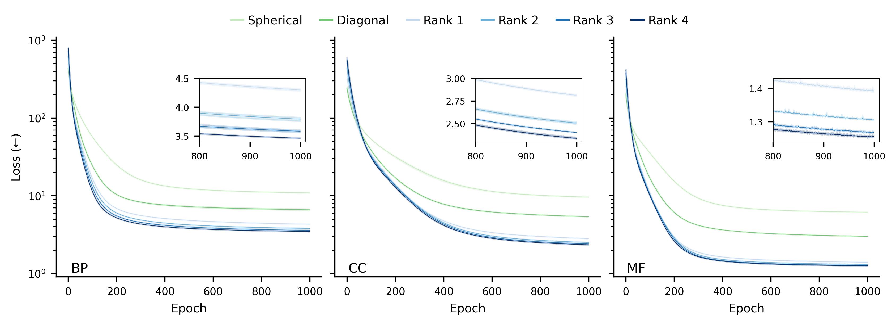

# gGN: learning to represent graph nodes as low-rank distributions

This repository is the official implementation of gGN: a novel neural network
to learn embeddings of nodes in graphs. Unlike existing approaches, gGN is
able to capture relationships between nodes with high accuracy by using
low-rank Gaussian distributions.

<p align="center">
  
</p>

<p align='center'>
  
  
  
</p>

## Dependencies

The code of gGN is completely written in [Python](https://www.python.org/) 3.7
and has the following packages as main dependencies:

* [PyTorch](https://pytorch.org/) 1.10.2
* [SciPy](https://scipy.org/) 1.7

These packages are automatically downloaded and installed when following the
instructions below.

**Note:** Alternatively, gGN can be directly executed, without local
   installation, on the Google cloud by means of the Jupyter notebooks
   available [below](#notebooks).

## Installation

To install gGN, the use of
[Conda](https://docs.conda.io/en/latest/miniconda.html) is strongly
recommended to set up a clean Python environment, which is useful to minimize
Python dependency conflicts. If Conda is not installed in your system, this
[link](https://docs.conda.io/projects/conda/en/latest/user-guide/install/index.html)
provides more information on how to install it. Once installed, the commands
below create and activate a new Conda environment.

```
conda create -n gGN python=3.7
conda activate gGN
```

Now, install the latest version of gGN directly from the sources.

```
pip install -U "ggn @ git+https://github.com/blindcosmos/ggn.git"
```

## Training

### Python code

gGN can be imported in a Python code.

```python
import scipy.sparse
import torch
import ggn
from ggn.models import LowRankEmbedder
from ggn.utils import MyCollator, fit

# load a pre-built matrix of shortest path lengths calculated from a toy graph
spmat    = scipy.sparse.load_npz(ggn.TOYGRAPH)

batch_sz = 128                           # batch size
dim      = 10                            # embedding dimension
rank     = 4                             # rank of embeddings
cuda     = 0                             # 0/no, 1/yes
nepochs  = 10                            # number of epochs
n_nodes  = spmat.shape[0]

# create dataloader using sparse matrix
ds = torch.utils.data.DataLoader(
  [torch.LongTensor([i]) for i in range(n_nodes)],
  batch_size=batch_sz,
  collate_fn=MyCollator(spmat, cuda)
)

embedder = LowRankEmbedder(n_nodes, dim=dim, rank=rank)
if cuda:
  embedder = embedder.cuda()

# build embeddings
fit(embedder, ds, epochs=nepochs)

# get embeddings
means = embedder.mean # means
diags = embedder.diag # diagonals
covms = embedder.covm # low-rank factors
```

### Command line

Once installed, gGN offers a command line utility to build your own node
embeddings from a given graph. To call this utility, use the following line

```
$ gGN [npz_fin] [emb_dim] [covm] [n_epochs] [batch_sz] [cuda] [prefix]
```

The arguments are

1. `npz_fin`:  A matrix in `.npz` format with the shortest paths between any node of a graph.
2. `emb_dim`:  Dimensionality of the embeddings.
3. `covm`:     Type of covariance matrices: -1/Spherical, 0/Diagonal or >0/Low-rank.
4. `n_epochs`: Number of epochs.
5. `batch_sz`: Batch size.
6. `cuda`:     Use cuda: 0/no, 1/yes.
7. `prefix`:   Prefix included in the names of the npy files used to store the built embeddings.

The following line shows how to use this utility to learn 2-dimensional node
embeddings from a toy graph (which is also analyzed in this
[notebook](https://colab.research.google.com/github/blindcosmos/ggn/blob/main/nbs/02-toy-graphs.ipynb)):

```
$ gGN TOYGRAPH 2 2 1000 10 0 output
```

This line outputs the low-rank Gaussian embeddings as `npy` files whose format
is further explained below.


### Input format

To learn Gaussian embeddings, gGN takes as input a sparse matrix S (`npz_fin`)
in `npz` format. This matrix **is not** an adjacency matrix, rather it
contains the shortest path length between any two nodes. The following figure
conceptually shows how this matrix is built from a given graph and fed as
input to gGN. In addition, the section [Notebooks](#notebooks) contains
examples on how to construct such a matrix.

<p align="center">
  
</p>

### Embedding format

Embeddings are stored as three `npy` files that contain the learned low-rank
Gaussian embeddings:

* means (&#956;),
* diagonal matrices (D) and
* low-rank factors (P).

<p align="center">
  
</p>

In these matrices, the rows index nodes while the number of columns indicates
the embedding dimensionality (d). Each cell of the matrix P additionally has a
depth equal to the rank (r).

Below, there is an example on how to use the `scipy` package to transform
these three matrices into Gaussian distributions. More examples are shown
[here](#notebooks).

```python
import numpy as np
from scipy.stats import multivariate_normal as mvnormal

import ggn

# load pre-learned gGN embeddings for a toy graph
means = np.load(ggn.TOYGRAPH_means)
diags = np.load(ggn.TOYGRAPH_diags)
covms = np.load(ggn.TOYGRAPH_covms)

# Instantiate Gaussian distributions from embeddings
mvns = [] # list of Gaussian distributions

# loop over each node
for mu_i, D_i, P_i in zip(means, diags, covms):
    # build the covariance matrix from the low-rank representation
    Sigma_i = np.diag(D_i) + (P_i @ P_i.T)

    # create the i-th Gaussian distribution
    mvn_i = mvnormal(mu_i, Sigma_i)

    mvns.append(mvn_i) # save Gaussian distribution
```

## Evaluation

### Semantic similarity (KL)

To compare two nodes, the
[KL divergence](https://en.wikipedia.org/wiki/Kullback%E2%80%93Leibler_divergence)
between their corresponding Gaussian distributions is computed, as shown
below.

```python
import numpy as np
import torch
import ggn
import ggn.distances


# load pre-learned gGN embeddings for a toy graph
means = np.load(ggn.TOYGRAPH_means)
diags = np.load(ggn.TOYGRAPH_diags)
covms = np.load(ggn.TOYGRAPH_covms)

# batch of indexes of distributions
idxs = np.array([1, 2, 3])

# calculate KL between each distribution in idxs and all the rest
kls = ggn.distances.lowrank_KL(
  torch.from_numpy(idxs),
  torch.from_numpy(means),
  torch.from_numpy(diags),
  torch.from_numpy(covms),
) # shape (idxs.shape[0], n)
```

### Entropy

The entropy of the low-rank Gaussian embeddings can be calculated, for
example, by first transforming them into Gaussian distributions using the
SciPy package (i.e., as shown above), and then

```python
mvns # list of Gaussian distributions ([scipy.stats.multivariate_normal])

entropies = []
for mvn in mvns:
  entropies.append(mvn.entropy())
```

## Data

All the data used for reproducing the experiments shown in the manuscript are
found in the folder `data`. It contains the
[Gene Ontology](http://geneontology.org/), release
[2020-10-06](./data/go.obo), from which the following adjacency and shortest
path lengths matrices were built:

<div align="center">

| Sub-ontology | Adjacency matrix | Shortest path length matrix (S) |
|:------------:|:----------------:|:---------------------------:|
|    BP        | [Link](./data/adjs/bp!adj.npz) | [Link](./data/spls/bp!spmat.npz) |
|    CC        | [Link](./data/adjs/cc!adj.npz) | [Link](./data/spls/cc!spmat.npz) |
|    MF        | [Link](./data/adjs/mf!adj.npz) | [Link](./data/spls/mf!spmat.npz) |

</div>

## Pre-trained Gaussian embeddings

The following table contains links to download the Gaussian embeddings built
from the GO (all used in the experiments):

<div align="center">
<table>
  <tr>
    <th rowspan=2>Graph</th>
    <th rowspan=2>Dim</th>
    <th colspan=14>Gaussian embeddings</th>
  </tr>
  <tr>
  <th colspan=2>Diagonal</th>
  <th colspan=3>Rank 1</th>
  <th colspan=3>Rank 2</th>
  <th colspan=3>Rank 3</th>
  <th colspan=3>Rank 4</th>
  </tr>

  <tr>
  <td rowspan=5>BP</td>
  <td>10</td>
  <td><a href="./data/embs/d10/bp_Diagonal_mean.npy">&#956;</a></td>
  <td><a href="./data/embs/d10/bp_Diagonal_diag.npy">D</a></td>
  <td><a href="./data/embs/d10/bp_LowRank1_mean.npy">&#956;</a></td>
  <td><a href="./data/embs/d10/bp_LowRank1_diag.npy">D</a></td>
  <td><a href="./data/embs/d10/bp_LowRank1_covm.npy">P</a></td>
  <td><a href="./data/embs/d10/bp_LowRank2_mean.npy">&#956;</a></td>
  <td><a href="./data/embs/d10/bp_LowRank2_diag.npy">D</a></td>
  <td><a href="./data/embs/d10/bp_LowRank2_covm.npy">P</a></td>
  <td><a href="./data/embs/d10/bp_LowRank3_mean.npy">&#956;</a></td>
  <td><a href="./data/embs/d10/bp_LowRank3_diag.npy">D</a></td>
  <td><a href="./data/embs/d10/bp_LowRank3_covm.npy">P</a></td>
  <td><a href="./data/embs/d10/bp_LowRank4_mean.npy">&#956;</a></td>
  <td><a href="./data/embs/d10/bp_LowRank4_diag.npy">D</a></td>
  <td><a href="./data/embs/d10/bp_LowRank4_covm.npy">P</a></td>
  </tr>

  <tr>
  <td>15</td>
  <td><a href="./data/embs/d15/bp_Diagonal_mean.npy">&#956;</a></td>
  <td><a href="./data/embs/d15/bp_Diagonal_diag.npy">D</a></td>
  <td><a href="./data/embs/d15/bp_LowRank1_mean.npy">&#956;</a></td>
  <td><a href="./data/embs/d15/bp_LowRank1_diag.npy">D</a></td>
  <td><a href="./data/embs/d15/bp_LowRank1_covm.npy">P</a></td>
  <td>-</td>
  <td>-</td>
  <td>-</td>
  <td>-</td>
  <td>-</td>
  <td>-</td>
  <td>-</td>
  <td>-</td>
  <td>-</td>
  </tr>

  <tr>
  <td>20</td>
  <td><a href="./data/embs/d20/bp_Diagonal_mean.npy">&#956;</a></td>
  <td><a href="./data/embs/d20/bp_Diagonal_diag.npy">D</a></td>
  <td><a href="./data/embs/d20/bp_LowRank1_mean.npy">&#956;</a></td>
  <td><a href="./data/embs/d20/bp_LowRank1_diag.npy">D</a></td>
  <td><a href="./data/embs/d20/bp_LowRank1_covm.npy">P</a></td>
  <td>-</td>
  <td>-</td>
  <td>-</td>
  <td>-</td>
  <td>-</td>
  <td>-</td>
  <td>-</td>
  <td>-</td>
  <td>-</td>
  </tr>

  <tr>
  <td>25</td>
  <td><a href="./data/embs/d25/bp_Diagonal_mean.npy">&#956;</a></td>
  <td><a href="./data/embs/d25/bp_Diagonal_diag.npy">D</a></td>
  <td><a href="./data/embs/d25/bp_LowRank1_mean.npy">&#956;</a></td>
  <td><a href="./data/embs/d25/bp_LowRank1_diag.npy">D</a></td>
  <td><a href="./data/embs/d25/bp_LowRank1_covm.npy">P</a></td>
  <td>-</td>
  <td>-</td>
  <td>-</td>
  <td>-</td>
  <td>-</td>
  <td>-</td>
  <td>-</td>
  <td>-</td>
  <td>-</td>
  </tr>

  <tr>
  <td>30</td>
  <td><a href="./data/embs/d30/bp_Diagonal_mean.npy">&#956;</a></td>
  <td><a href="./data/embs/d30/bp_Diagonal_diag.npy">D</a></td>
  <td><a href="./data/embs/d30/bp_LowRank1_mean.npy">&#956;</a></td>
  <td><a href="./data/embs/d30/bp_LowRank1_diag.npy">D</a></td>
  <td><a href="./data/embs/d30/bp_LowRank1_covm.npy">P</a></td>
  <td>-</td>
  <td>-</td>
  <td>-</td>
  <td>-</td>
  <td>-</td>
  <td>-</td>
  <td>-</td>
  <td>-</td>
  <td>-</td>
  </tr>

  <tr>
  <td rowspan=5>CC</td>
  <td>10</td>
  <td><a href="./data/embs/d10/cc_Diagonal_mean.npy">&#956;</a></td>
  <td><a href="./data/embs/d10/cc_Diagonal_diag.npy">D</a></td>
  <td><a href="./data/embs/d10/cc_LowRank1_mean.npy">&#956;</a></td>
  <td><a href="./data/embs/d10/cc_LowRank1_diag.npy">D</a></td>
  <td><a href="./data/embs/d10/cc_LowRank1_covm.npy">P</a></td>
  <td><a href="./data/embs/d10/cc_LowRank2_mean.npy">&#956;</a></td>
  <td><a href="./data/embs/d10/cc_LowRank2_diag.npy">D</a></td>
  <td><a href="./data/embs/d10/cc_LowRank2_covm.npy">P</a></td>
  <td><a href="./data/embs/d10/cc_LowRank3_mean.npy">&#956;</a></td>
  <td><a href="./data/embs/d10/cc_LowRank3_diag.npy">D</a></td>
  <td><a href="./data/embs/d10/cc_LowRank3_covm.npy">P</a></td>
  <td><a href="./data/embs/d10/cc_LowRank4_mean.npy">&#956;</a></td>
  <td><a href="./data/embs/d10/cc_LowRank4_diag.npy">D</a></td>
  <td><a href="./data/embs/d10/cc_LowRank4_covm.npy">P</a></td>
  </tr>

  <tr>
  <td>15</td>
  <td><a href="./data/embs/d15/cc_Diagonal_mean.npy">&#956;</a></td>
  <td><a href="./data/embs/d15/cc_Diagonal_diag.npy">D</a></td>
  <td><a href="./data/embs/d15/cc_LowRank1_mean.npy">&#956;</a></td>
  <td><a href="./data/embs/d15/cc_LowRank1_diag.npy">D</a></td>
  <td><a href="./data/embs/d15/cc_LowRank1_covm.npy">P</a></td>
  <td>-</td>
  <td>-</td>
  <td>-</td>
  <td>-</td>
  <td>-</td>
  <td>-</td>
  <td>-</td>
  <td>-</td>
  <td>-</td>
  </tr>

  <tr>
  <td>20</td>
  <td><a href="./data/embs/d20/cc_Diagonal_mean.npy">&#956;</a></td>
  <td><a href="./data/embs/d20/cc_Diagonal_diag.npy">D</a></td>
  <td><a href="./data/embs/d20/cc_LowRank1_mean.npy">&#956;</a></td>
  <td><a href="./data/embs/d20/cc_LowRank1_diag.npy">D</a></td>
  <td><a href="./data/embs/d20/cc_LowRank1_covm.npy">P</a></td>
  <td>-</td>
  <td>-</td>
  <td>-</td>
  <td>-</td>
  <td>-</td>
  <td>-</td>
  <td>-</td>
  <td>-</td>
  <td>-</td>
  </tr>

  <tr>
  <td>25</td>
  <td><a href="./data/embs/d25/cc_Diagonal_mean.npy">&#956;</a></td>
  <td><a href="./data/embs/d25/cc_Diagonal_diag.npy">D</a></td>
  <td><a href="./data/embs/d25/cc_LowRank1_mean.npy">&#956;</a></td>
  <td><a href="./data/embs/d25/cc_LowRank1_diag.npy">D</a></td>
  <td><a href="./data/embs/d25/cc_LowRank1_covm.npy">P</a></td>
  <td>-</td>
  <td>-</td>
  <td>-</td>
  <td>-</td>
  <td>-</td>
  <td>-</td>
  <td>-</td>
  <td>-</td>
  <td>-</td>
  </tr>

  <tr>
  <td>30</td>
  <td><a href="./data/embs/d30/cc_Diagonal_mean.npy">&#956;</a></td>
  <td><a href="./data/embs/d30/cc_Diagonal_diag.npy">D</a></td>
  <td><a href="./data/embs/d30/cc_LowRank1_mean.npy">&#956;</a></td>
  <td><a href="./data/embs/d30/cc_LowRank1_diag.npy">D</a></td>
  <td><a href="./data/embs/d30/cc_LowRank1_covm.npy">P</a></td>
  <td>-</td>
  <td>-</td>
  <td>-</td>
  <td>-</td>
  <td>-</td>
  <td>-</td>
  <td>-</td>
  <td>-</td>
  <td>-</td>
  </tr>

  <tr>
  <td rowspan=5>MF</td>
  <td>10</td>
  <td><a href="./data/embs/d10/mf_Diagonal_mean.npy">&#956;</a></td>
  <td><a href="./data/embs/d10/mf_Diagonal_diag.npy">D</a></td>
  <td><a href="./data/embs/d10/mf_LowRank1_mean.npy">&#956;</a></td>
  <td><a href="./data/embs/d10/mf_LowRank1_diag.npy">D</a></td>
  <td><a href="./data/embs/d10/mf_LowRank1_covm.npy">P</a></td>
  <td><a href="./data/embs/d10/mf_LowRank2_mean.npy">&#956;</a></td>
  <td><a href="./data/embs/d10/mf_LowRank2_diag.npy">D</a></td>
  <td><a href="./data/embs/d10/mf_LowRank2_covm.npy">P</a></td>
  <td><a href="./data/embs/d10/mf_LowRank3_mean.npy">&#956;</a></td>
  <td><a href="./data/embs/d10/mf_LowRank3_diag.npy">D</a></td>
  <td><a href="./data/embs/d10/mf_LowRank3_covm.npy">P</a></td>
  <td><a href="./data/embs/d10/mf_LowRank4_mean.npy">&#956;</a></td>
  <td><a href="./data/embs/d10/mf_LowRank4_diag.npy">D</a></td>
  <td><a href="./data/embs/d10/mf_LowRank4_covm.npy">P</a></td>
  </tr>

  <tr>
  <td>15</td>
  <td><a href="./data/embs/d15/mf_Diagonal_mean.npy">&#956;</a></td>
  <td><a href="./data/embs/d15/mf_Diagonal_diag.npy">D</a></td>
  <td><a href="./data/embs/d15/mf_LowRank1_mean.npy">&#956;</a></td>
  <td><a href="./data/embs/d15/mf_LowRank1_diag.npy">D</a></td>
  <td><a href="./data/embs/d15/mf_LowRank1_covm.npy">P</a></td>
  <td>-</td>
  <td>-</td>
  <td>-</td>
  <td>-</td>
  <td>-</td>
  <td>-</td>
  <td>-</td>
  <td>-</td>
  <td>-</td>
  </tr>

  <tr>
  <td>20</td>
  <td><a href="./data/embs/d20/mf_Diagonal_mean.npy">&#956;</a></td>
  <td><a href="./data/embs/d20/mf_Diagonal_diag.npy">D</a></td>
  <td><a href="./data/embs/d20/mf_LowRank1_mean.npy">&#956;</a></td>
  <td><a href="./data/embs/d20/mf_LowRank1_diag.npy">D</a></td>
  <td><a href="./data/embs/d20/mf_LowRank1_covm.npy">P</a></td>
  <td>-</td>
  <td>-</td>
  <td>-</td>
  <td>-</td>
  <td>-</td>
  <td>-</td>
  <td>-</td>
  <td>-</td>
  <td>-</td>
  </tr>

  <tr>
  <td>25</td>
  <td><a href="./data/embs/d25/mf_Diagonal_mean.npy">&#956;</a></td>
  <td><a href="./data/embs/d25/mf_Diagonal_diag.npy">D</a></td>
  <td><a href="./data/embs/d25/mf_LowRank1_mean.npy">&#956;</a></td>
  <td><a href="./data/embs/d25/mf_LowRank1_diag.npy">D</a></td>
  <td><a href="./data/embs/d25/mf_LowRank1_covm.npy">P</a></td>
  <td>-</td>
  <td>-</td>
  <td>-</td>
  <td>-</td>
  <td>-</td>
  <td>-</td>
  <td>-</td>
  <td>-</td>
  <td>-</td>
  </tr>

  <tr>
  <td>30</td>
  <td><a href="./data/embs/d30/mf_Diagonal_mean.npy">&#956;</a></td>
  <td><a href="./data/embs/d30/mf_Diagonal_diag.npy">D</a></td>
  <td><a href="./data/embs/d30/mf_LowRank1_mean.npy">&#956;</a></td>
  <td><a href="./data/embs/d30/mf_LowRank1_diag.npy">D</a></td>
  <td><a href="./data/embs/d30/mf_LowRank1_covm.npy">P</a></td>
  <td>-</td>
  <td>-</td>
  <td>-</td>
  <td>-</td>
  <td>-</td>
  <td>-</td>
  <td>-</td>
  <td>-</td>
  <td>-</td>
  </tr>
</table>
</div>

## Notebooks

The following notebooks reproduce different experiments and provide all the
technical details to use gGN.

<div align="center">
<table>
  <tr>
  <th>Topic</th>
  <th>Subject</th>
  <th>Notebook</th>
  </tr>

  <tr>
  <td  rowspan=2>Input data</td>
  <td align ="left">Generate matrix of shortest path lengths from a toy graph</td>
  <td><a href="https://colab.research.google.com/github/blindcosmos/ggn/blob/main/nbs/00-calculate-shortest-path-lengths-for-a-toy-graph.ipynb">Link</a></td>
  </tr>
  <tr>
  <td align ="left">Generate matrix of shortest path legnths for the GO</td>
  <td><a href="https://colab.research.google.com/github/blindcosmos/ggn/blob/main/nbs/01-generating-shortest-path-matrices-for-GO.ipynb">Link</a></td>
  </tr>

  <tr>
  <td  rowspan=3>Training</td>
  <td align ="left">Learn low-rank Gaussian embeddings for a toy graph</td>
  <td><a href="https://colab.research.google.com/github/blindcosmos/ggn/blob/main/nbs/02-toy-graphs.ipynb">Link</a></td>
  </tr>

  <tr>
  <td align ="left">Load gGN on Python to learn low-rank Gaussian embeddings</td>
  <td><a href="https://colab.research.google.com/github/blindcosmos/ggn/blob/main/nbs/06-using-gGN-on-Python.ipynb">Link</a></td>
  </tr>

  <tr>
  <td align ="left">Learn low-rank Gaussian embeddings for the GO</td>
  <td><a href="https://colab.research.google.com/github/blindcosmos/ggn/blob/main/nbs/03-building-Gaussian-embeddings-from-scratch.ipynb">Link</a></td>
  </tr>

  <tr>
  <td  rowspan=2>Evaluation</td>
  <td align ="left">Evaluate the KL between pre-trained low-rank Gaussian embeddings</td>
  <td><a href="https://colab.research.google.com/github/blindcosmos/ggn/blob/main/nbs/04-evaluation-KL.ipynb">Link</a></td>
  </tr>
  <tr>
  <td align ="left">Evaluate the entropy of pre-trained low-rank Gaussian embeddings</td>
  <td><a href="https://colab.research.google.com/github/blindcosmos/ggn/blob/main/nbs/05-evaluation-entropy.ipynb">Link</a></td>
  </tr>
</table>
</div>


## Results

The figure below shows that the use of the proposed low-rank approximation
reduces significantly the loss values in comparison to the spherical and
diagonal approximations, which are commonly used by existing node
representations. Here, the lower the loss values are, the better graph
features are encoded by the node embeddings. These results show the modeling
benefits of using the low-rank representation.

<p align="center">
  
</p>

The following table shows the performance of the low-rank Gaussian embeddings
in a semantic similarity task on the GO. Here the aim was to discriminate
between pairs of nodes in which the first node is either an ancestor or a
descendant of the other node. For a systematic comparison across all pairs,
the
[Davies-Bouldin index](https://en.wikipedia.org/wiki/Davies%E2%80%93Bouldin_index)
was used to measure the level of overlap between the semantic similarities of
both types of pairs. The lower the index, the less overlapped both
distributions are. The results below show that the low-rank approximations
obtain the lower indices.

<div align="center">

| Method     | BP       | CC       | MF      |
|:-----------|--------: |---------:|--------:|
|Li          | ∞        | ∞        | ∞       |
|Resnik      | ∞        | ∞        | ∞       |
|AIC         | ∞        | ∞        | ∞       |
|Wang        | 452.0    |  11.8    | 12.6    |
|GOGO        | 225.5    |  8.8     | 12.6    |
|AROPE       | 394.2    |  27.3    | 21.8    |
|GraRep      | 172.5    |  6.7     | 12.4    |
|SVD-anc     | 69.2     |  11.5    | 15.5    |
|SVD-des     | 290.3    |  23.2    | 37.6    |
|DeepWalk    | 1465.8   |  6.8     | 12.9    |
|LINE        | 39.3     |  8.4     | 19.3    |
|node2vec    | 505.1    |  21.1    | 35.1    |
|VERSE       | 301.9    |  8.4     | 14.3    |
|onto2vec    | 282.6    |  8.2     | 13.0    |
|anc2vec     | 46.5     |  10.0    | 21.3    |
|neig2vec    | 66.3     |  11.4    | 37.8    |
|Graph2Gauss | 5.0      |  3.6     | 39.7    |
|Spherical   | 2.7      |  13.2    | 2.2     |
|Diagonal    | 1.6      |  1.9     | 1.7     |
|Rank 1      | 1.0      |  0.9     | 0.8     |
|Rank 2      | 0.9      |  0.8     | 0.7     |
|Rank 3      | **0.8**  |  **0.7** | **0.7** |
|Rank 4      | **0.8**  |  **0.7** | **0.7** |

</div>

## Contributing

Contributions from anyone are welcome. You can start by adding a new entry
[here](https://github.com/blindcosmos/ggn/issues).

## License

gGN is licensed under the MIT license. See [LICENSE](./LICENSE) for more details.
